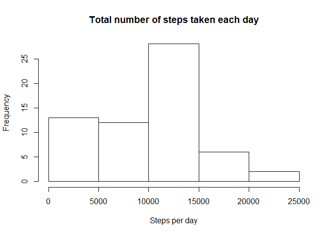
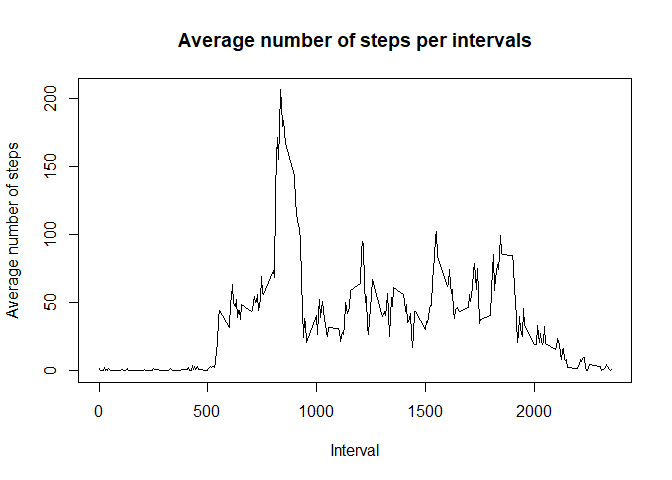
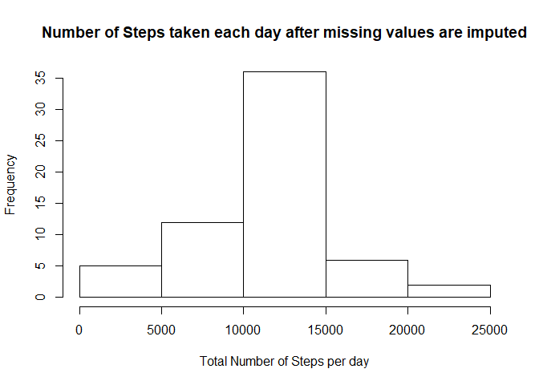
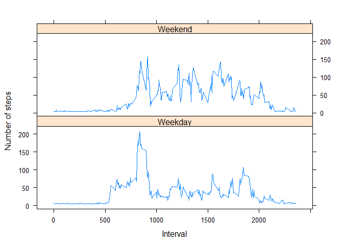

### Loading and preprocessing the data

Description of the dataset used in this assignment is given below:

*This assignment makes use of data from a personal activity monitoring device. This device collects data at 5 minute intervals through out the day. The data consists of two months of data from an anonymous individual collected during the months of October and November, 2012 and include the number of steps taken in 5 minute intervals each day.*

The variables included in this dataset are:

* steps: Number of steps taking in a 5-minute interval (missing values are coded as NA)
* date: The date on which the measurement was taken in YYYY-MM-DD format
* interval: Identifier for the 5-minute interval in which measurement was taken

Now, I will download and unzip the dataset


```r
filename <- "activity_monitoring_data.zip"

if (!file.exists(filename)){
    fileURL <- "https://d396qusza40orc.cloudfront.net/repdata%2Fdata%2Factivity.zip"
    download.file(fileURL, filename)
}  

if (!file.exists("activity_monitoring_data")) { 
    unzip(filename)
}
```
Now I will read the dataset in a dataframe and inspect the structure of data

```r
data <- read.csv("activity.csv")
names(data)
```

```
## [1] "steps"    "date"     "interval"
```

```r
str(data)
```

```
## 'data.frame':	17568 obs. of  3 variables:
##  $ steps   : int  NA NA NA NA NA NA NA NA NA NA ...
##  $ date    : Factor w/ 61 levels "2012-10-01","2012-10-02",..: 1 1 1 1 1 1 1 1 1 1 ...
##  $ interval: int  0 5 10 15 20 25 30 35 40 45 ...
```

```r
head(data)
```

```
##   steps       date interval
## 1    NA 2012-10-01        0
## 2    NA 2012-10-01        5
## 3    NA 2012-10-01       10
## 4    NA 2012-10-01       15
## 5    NA 2012-10-01       20
## 6    NA 2012-10-01       25
```
I need to change the datatype of *date* from factor to date. To do this use

```r
data$date <- as.Date(data$date, "%Y-%m-%d")
```

### Histogram of total number of steps taken per day

To create the histogram first I need to find the total number of steps taken on each day. For this I'll use the aggregate function and remove the NA values.

```r
total_steps <- aggregate(data['steps'], by = data['date'], sum, na.rm = T)
```
Now I can plot the histogram using the base plot system

```r
hist(total_steps$steps, xlab = "Steps per day", main = "Total number of steps taken each day")
```

<!-- -->

Mean of the total number of steps taken per day

```r
mean(total_steps$steps)
```

```
## [1] 9354.23
```
Median of the total number of steps taken per day

```r
median(total_steps$steps)
```

```
## [1] 10395
```

### Average daily activity pattern

In this, a time series plot (i.e. type = "l") of the 5-minute interval (x-axis) is made and the average number of steps taken, averaged across all days (y-axis) is calculated by

```r
average_activity <- aggregate(data['steps'], by = data['interval'], mean, na.rm = T)
```
To make the plot I used the base plot system with type specified as lines

```r
plot(average_activity$interval, average_activity$steps, type = "l", xlab = "Interval", ylab = "Average number of steps", main = "Average number of steps per intervals")
```

<!-- -->

To find which 5-minute interval, on average across all the days in the dataset, contains the maximum number of steps I used the following code

```r
average_activity[which.max(average_activity$steps), ]$interval
```

```
## [1] 835
```

### Imputing missing values

The total number of missing values can be calculated as

```r
sum(is.na(data))
```

```
## [1] 2304
```
I filled in the missing values with the mean of the steps and created a new dataset named *data0*

```r
m<-mean(average_activity$steps)
data0 <- data
data0[is.na(data[ ,1]),1] <- m
```
Now to plot the histogram, first I need to calculate the total number of steps taken each day in this new dataset

```r
total_steps_by_day <- aggregate(data0['steps'], by = data0['date'], sum)
```
Now the histogram can be plotted

```r
hist(total_steps_by_day$steps, xlab = "Total Number of Steps per day", main = "Number of Steps taken each day after missing values are imputed")
```

<!-- -->

Mean of the total number of steps taken per day

```r
mean(total_steps$steps)
```

```
## [1] 9354.23
```
Median of the total number of steps taken per day

```r
median(total_steps$steps)
```

```
## [1] 10395
```
The mean and median come out to be same when I filled the missing values with the mean of steps

### Differences in activity patterns between weekdays and weekends

First I created a new column in the imputed values dataset named *week*. The *week* column tells whether the given day is a weekday or weekend. To find this I loop over the entire dataset using sapply and make a simple if-else function as shown

```r
data0$week <- sapply(data0$date, function(x) {
    if (weekdays(x) == "Saturday" | weekdays(x) == "Sunday") 
        day <- "Weekend"
    else 
        day <- "Weekday"
    day
})
```
Now I calculated the total number of steps by the interval and the type of day (weekday/weekend)

```r
steps_by_day <- aggregate(data0['steps'], by = c(data0['interval'], data0['week']), mean)
```
To draw the plot I used the lattice plotting system

```r
library(lattice)
xyplot(steps ~ interval | week, steps_by_day, type = "l", layout = c(1, 2), xlab = "Interval", ylab = "Number of steps")
```

<!-- -->
